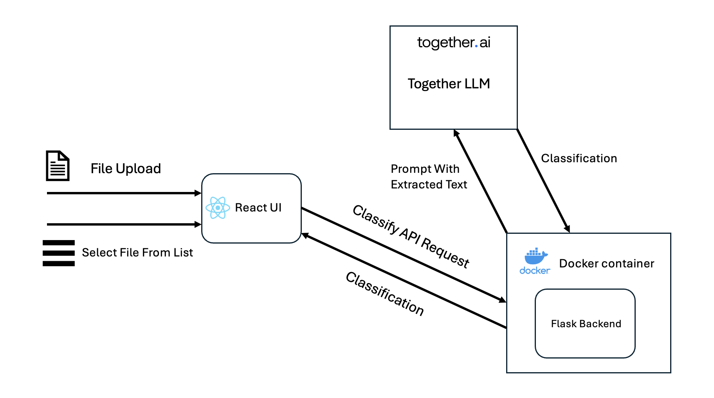

# Heron Coding Challenge - File Classifier

[Link to application](https://jackbrand900.github.io/frontend-repo/)

## Overview

This project enhances a document classification system to support:

- Poorly named or inconsistently labeled files  
- A wide range of document formats  
- Scalability to new industries and use cases  
- Robust classification at larger volumes

It includes a content-based classifier powered by a large language model (LLM), a synthetic data generator for category prototyping, a Dockerized backend deployed via Render, and a frontend hosted on GitHub Pages.

---

## How the Classifier Works

Overview of classification:



The system first extracts text from uploaded files depending on their type:

- **PDFs**: `PyPDF2`
- **Images** (JPEG, PNG): OCR via `pytesseract`
- **Word documents**: `python-docx`
- **Excel sheets**: `openpyxl`

Initially, I used a linear regression model that classified based on vectorized file names and content. However, as more categories and synthetic data were added, its performance degraded. I replaced this with an LLM-based classifier using the Together API, which proved more scalable and accurate—especially since it doesn't require retraining when new categories are added.

The LLM (Mistral) is prompted with:

```
You are an AI assistant that classifies documents into one of the following categories: <category_1>, <category_2>, ...

Respond with only one word — the exact label. Do not explain your answer.

Document content:
<first 4000 characters of file text>

What is the category?
```

This content-only, dynamically generated prompt enables the system to adapt to new categories without modification to the underlying classifier. 

Note: because I am on the free-tier of Together.ai, rate-limiting can occasionally result in "unknown" being predicted for a file. If this occurs, please wait a bit and try again. If this were a production environment, a higher limit / local LLM would be used.

To support prototyping and low-data environments, I built a **synthetic document generator**. It can create variable numbers of synthetic documents (up to 10 at a time) in multiple formats, with randomized subsets of fields selected to mimic real-world variation.

### Why This Matters

- **Supports new industries**: You can instantly prototype document types for banking, insurance, HR, etc.
- **Removes dependency on real data**: No need for manually collected examples
- **Improves classifier robustness**: Randomized fields ensure the model doesn't overfit to a single layout or format

This functionality helps the classifier remain adaptable and scalable without requiring retraining, making it suitable for dynamic or low-data environments.

---

## How to Use the Classifier

The app can be used at [(https://jackbrand900.github.io/frontend-repo/)](https://jackbrand900.github.io/frontend-repo/)

The app can also be run locally through Docker.

### Run the app locally

```bash
docker-compose up --build
```

Once running, the backend is available at:

```
http://localhost:5050
```

Set your API key in a `.env` file:

```
TOGETHER_API_KEY=your_api_key_here
```

### Example classification request:

```bash
curl -X POST http://localhost:5050/classify_file \
  -F "file=@files/invoice_1.pdf" \
  -F "method=llm"
```

You should receive a JSON response with the predicted label.

## Creating a New Document Category

You can create a new document category and generate synthetic examples using the `/generate_category` endpoint.

### Endpoint

```
POST /generate_category
```

### Description

Creates a new category with the specified label and fields, and generates synthetic documents for it. These synthetic documents are saved to the system and used in classification and training.

### Request Body (JSON)

```json
{
  "label": "pay_stub",
  "fields": ["employee_name", "net_income", "pay_period"],
  "num": 5
}
```

- `label` *(string, required)*: The category name (e.g., `pay_stub`)
- `fields` *(list of strings, required)*: Field names to include in the synthetic documents
- `num` *(integer, optional)*: Number of synthetic documents to generate (default: 10, max: 10)

### Example Request (cURL)

```bash
curl -X POST http://localhost:5050/generate_category \
  -H "Content-Type: application/json" \
  -d '{
        "label": "pay_stub",
        "fields": ["employee_name", "net_income", "pay_period"],
        "num": 5
      }'
```

### Example Response

```json
{
  "status": "success",
  "label": "pay_stub",
  "samples_generated": 5,
  "retrained": true
}
```

### Error Responses

- `400 Bad Request` – If `label` or `fields` are missing
- `500 Internal Server Error` – If generation fails


## Running the UI Locally

To run the React frontend on your machine:

1. Navigate to the frontend directory:

   ```bash
   cd frontend
   ```

2. Install dependencies:

   ```bash
   npm install
   ```

3. Create a `.env` file (if one doesn’t exist) and add:

   ```
   REACT_APP_API_URL=http://localhost:5050
   ```

   This ensures the frontend knows where to send API requests.

4. Start the development server:

   ```bash
   npm start
   ```

   The app will be available at `http://localhost:3000`.

---

## Enabling CORS for the Local Frontend

To allow the frontend at `localhost:3000` to communicate with the Flask backend at `localhost:5050`, enable CORS in your Flask app:

1. Install `flask-cors`:

   ```bash
   pip install flask-cors
   ```

2. In your `src/app.py`, add:

   ```python
   from flask import Flask
   from flask_cors import CORS

   app = Flask(__name__)
   CORS(app, origins=["http://localhost:3000"])
   ```

This ensures the browser doesn’t block requests between the frontend and backend during local development.

---

### Frontend

The UI has two parts:
- A **classifier panel** for uploading or selecting a file
- A **category creation panel** for defining new categories and generating synthetic examples

This frontend is hosted via GitHub Pages and interacts directly with the backend API.

---

## Part 1: Enhancing the Classifier

### Limitations of the Original System

The original filename-based approach failed in real-world cases:
- Typos (e.g., `drivrs-licnce.jpg`)
- Inconsistent naming (e.g., "bill" vs. "invoice")
- Manual keyword mapping for each new category

Maintaining these mappings was not scalable and required redeployment for each change.

Additionally, only PDFs and JPEGs were supported. I expanded this to include DOCX, XLSX, and images, using format-specific Python libraries to extract text in a modular way.

Finally, the ML model didn't scale well for this use case. As synthetic data increased, performance dropped due to overfitting and class imbalance. Retraining became cumbersome, and the model lost generalization. Switching to an LLM removed these bottlenecks and simplified the pipeline.

---

## Part 2: Productionising the Classifier

To prepare the system for production, I:

- Implemented **CI/CD with GitHub Actions** to run tests and deploy on every commit  
- Wrote **unit tests** for file parsing, classification logic, and edge cases  
- Deployed the backend on **Render** and the frontend on **GitHub Pages**  
- Used **Docker** to ensure environment consistency across deployments  

For larger-scale use, I would:
- Support **batch classification** of uploaded files
- Introduce **cloud storage and queue-based processing** (e.g., Kafka)
- Add **database-backed classification logs** for traceability

---

## Future Improvements

If time allowed, I would expand the system with:

- **Active learning loops** to prompt user labeling for low-confidence predictions  
- **Preprocessing pipelines** to standardize formats like dates and currencies  
- **Attention-based models** to pick up layout features (e.g., headers, logos)  
- **Model versioning and rollback** to automatically revert if performance drops  

---

## Final Thoughts

I really enjoyed working on this task, and it made me think about all the complexities inherent in what on its face seemed to be a relatively simple problem. The more I dug into the possible use-cases and issues, the more ideas and approaches I came up with. I know that this is just scratching the surface of the work being done at Heron Data, so I’m excited about the possibility to work on such interesting projects if I’m fortunate enough to join the team at Heron. Thank you for the time taken to review my approach and I look forward to hearing from you!

---
## Overview

At Heron, we’re using AI to automate document processing workflows in financial services and beyond. Each day, we handle over 100,000 documents that need to be quickly identified and categorised before we can kick off the automations.

This repository provides a basic endpoint for classifying files by their filenames. However, the current classifier has limitations when it comes to handling poorly named files, processing larger volumes, and adapting to new industries effectively.

**Your task**: improve this classifier by adding features and optimisations to handle (1) poorly named files, (2) scaling to new industries, and (3) processing larger volumes of documents.

This is a real-world challenge that allows you to demonstrate your approach to building innovative and scalable AI solutions. We’re excited to see what you come up with! Feel free to take it in any direction you like, but we suggest:


### Part 1: Enhancing the Classifier

- What are the limitations in the current classifier that's stopping it from scaling?
- How might you extend the classifier with additional technologies, capabilities, or features?


### Part 2: Productionising the Classifier 

- How can you ensure the classifier is robust and reliable in a production environment?
- How can you deploy the classifier to make it accessible to other services and users?

We encourage you to be creative! Feel free to use any libraries, tools, services, models or frameworks of your choice

### Possible Ideas / Suggestions
- Train a classifier to categorize files based on the text content of a file
- Generate synthetic data to train the classifier on documents from different industries
- Detect file type and handle other file formats (e.g., Word, Excel)
- Set up a CI/CD pipeline for automatic testing and deployment
- Refactor the codebase to make it more maintainable and scalable

## Marking Criteria
- **Functionality**: Does the classifier work as expected?
- **Scalability**: Can the classifier scale to new industries and higher volumes?
- **Maintainability**: Is the codebase well-structured and easy to maintain?
- **Creativity**: Are there any innovative or creative solutions to the problem?
- **Testing**: Are there tests to validate the service's functionality?
- **Deployment**: Is the classifier ready for deployment in a production environment?


## Getting Started
1. Clone the repository:
    ```shell
    git clone <repository_url>
    cd heron_classifier
    ```

2. Install dependencies:
    ```shell
    python -m venv venv
    source venv/bin/activate
    pip install -r requirements.txt
    ```

3. Run the Flask app:
    ```shell
    python -m src.app
    ```

4. Test the classifier using a tool like curl:
    ```shell
    curl -X POST -F 'file=@path_to_pdf.pdf' http://127.0.0.1:5000/classify_file
    ```

5. Run tests:
   ```shell
    pytest
    ```

## Submission

Please aim to spend 3 hours on this challenge.

Once completed, submit your solution by sharing a link to your forked repository. Please also provide a brief write-up of your ideas, approach, and any instructions needed to run your solution. 
